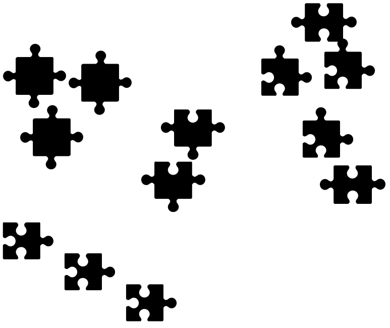

```{r setup, include=FALSE}
library(tidyverse); 
library(broom);
library(ggrepel);
library(knitr);
library(glue);
library(MASS);
library(tidyverse);
library(broom);
library(RColorBrewer);
library(pROC);
knitr::opts_chunk$set(echo = T, warning = F, message = F, cache = F);
knitr::knit_hooks$set(mysize = function(before, options, envir) {
  if (before) 
    return(options$size);
})
options(digits = 3);
figure_scaler = 1/2;#1/2-3/8 for ioslides; ~1/3 for word, pdf
text_scaler = 3/3;#1 for ioslides; 2/3 for word, pdf
fig.x = 16 * figure_scaler;
fig.y = 9 * figure_scaler;
cex_scale = 9 * figure_scaler;
theme_set(theme_bw())

```

## Q: Which puzzle-building strategy is best, and how good is it?

## Start with edge pieces


## Sort and build high contrast/color regions


## Sort into knob-and-hole combinations




## How to measure puzzle strategy success/failure?

- time to completion
- average # tries to fitting piece
- proportion of first tries that fit

# Defining terms

##

*model selection*  is "estimating the performance of different models in order to choose the best one"

- identify the best puzzle building strategy from among the candidates on a relative basis

*model assessment*  is, "having chosen a final model, estimating its prediction error...on new data" 

- measuring how good your chosen puzzle building strategy is

@hastie.elements


## Two main considerations

1. Using data honestly
2. Measuring error

# Using data honestly

## Notation

Each observation's outcome $Y$ (continuous or categorical) is to be predicted with
function of auxiliary knowledge, i.e. covariates, from that observation $X=x$, 
denoted as $\hat Y(x)$

Want $\hat Y(x)$ to be close to $Y$, but need to define what is meant by "close"

Use 'mean squared prediction error' (MSPE) for now: $(Y - \hat Y(x))^2$

## Numeric example (binary outcome)

- $n = 100$ observations each in training and validation
- $p = 40$ covariates, distributed as independent normal random variables
- $p/2 = 20$ of coefficients equal to 0.25; remaining equal to 0
- Expected prevalence of about 0.6
- $\hat Y(x)=\hat{\Pr}(Y=1|X=x) = 1/(1+\exp(-\hat\alpha+ x\hat\beta))$

```{r, include = TRUE, cache = TRUE}
set.seed(7201969);
#n = 200 observations; split into equal parts
n <- 200;
training_subset = 1:round(n/2);
validation_subset = (round(n/2)+1):n;
#p covariates
p <- 40;
#baseline prevalence approximately 0.6
intercept = log(0.6/0.4);
#normally distributed covariates
x <- matrix(rnorm(n*p), 
            nrow = n, 
            dimnames = list(NULL,glue("x{1:p}")));
#half of covariates have odds ratios exp(0.25) 
beta <- c(rep(0.25, floor(p/2)), numeric(ceiling(p/2)));
true_probs <- 1/(1+exp(-intercept - drop(x%*%beta)));
y <- rbinom(n, 1, true_probs);
all_data <- bind_cols(y = y, data.frame(x));
full_fmla <- 
  glue("y~{glue_collapse(glue('x{1:p}'),sep='+')}") %>%
  as.formula();
```

##

Six strategies considered:

- True model ('(truth)'; for benchmarking)
- Intercept only ('null'; not considered for selection)
- All covariates ('full')
- Forward selection ('forward'): start with the null model, incrementally
add in covariates that seem to improve fit
- Forward selection with max of 1 variable / 10 observations ('forward_pruned')
- Backward selection ('backward'): start will the full model, incrementally
subtract covariates that seem to harm fit

```{r, include = TRUE, cache = TRUE}
full_model = glm(full_fmla,
                 data = all_data,
                 subset = training_subset, 
                 family = "binomial");
null_model = glm(y ~ 1,
                 data = all_data,
                 subset = training_subset, 
                 family = "binomial");

#forward selection (using MASS package)
forward_model <- 
  stepAIC(null_model,
          scope = list(upper = full_fmla),
          direction = "forward",
          trace = F);

#pruned forward selection: max of 1 coefficient per 10 training observations 
forward_pruned_model <- 
  stepAIC(null_model,
          scope = list(upper = full_fmla),
          direction = "forward",
          steps = max(1, floor(n/2/10)),
          trace = F);

#backward selection
backward_model <- 
  stepAIC(full_model,
          direction = "backward",
          trace = F);

```

## Selection 

```{r, echo = TRUE, include = TRUE, cache = TRUE}
tidy(full_model) %>% 
  left_join(tibble(term = glue("x{1:floor(p/2)}"), 
                   nonzero = 1)) %>%
  mutate(nonzero = replace_na(nonzero, 0)) %>%
  arrange(p.value);
```

##

```{r, echo = TRUE, include = TRUE, cache = TRUE}
tidy(forward_model) %>% 
  left_join(tibble(term = glue("x{1:floor(p/2)}"), 
                   nonzero = 1)) %>%
  mutate(nonzero = replace_na(nonzero, 0)) %>%
  arrange(p.value);
```

## 
```{r, echo = TRUE, include = TRUE, cache = TRUE}
tidy(forward_pruned_model) %>% 
  left_join(tibble(term = glue("x{1:floor(p/2)}"), 
                   nonzero = 1)) %>%
  mutate(nonzero = replace_na(nonzero, 0)) %>%
  arrange(p.value);
```

## 

```{r, echo = TRUE, include = TRUE, cache = TRUE}
tidy(backward_model) %>%
  left_join(tibble(term = glue("x{1:floor(p/2)}"), 
                   nonzero = 1)) %>%
  mutate(nonzero = replace_na(nonzero, 0)) %>%
  arrange(p.value);
```

## 

```{r, include = TRUE, cache = TRUE}

predict_models <- 
  list(null = null_model, 
       full = full_model, 
       forward = forward_model, 
       forward_pruned = forward_pruned_model, 
       backward = backward_model) %>%
  map_dfc(predict, newdata = all_data, type = 'resp') %>%
  mutate(true_probs = true_probs,
         y = y, 
         training = row_number() %in% training_subset) %>%
  pivot_longer(c(true_probs, null:backward),
               names_to = "model_name") %>%
  mutate(model_name = factor(model_name) %>% fct_inorder())

```

## Training MSPEs

$\dfrac{1}{100}\sum_{i=1}^{100} (Y_i - \hat Y(x_i))^2$ 

```{r, include = TRUE, cache = TRUE}
predict_models %>% 
  filter(training) %>%
  group_by(model_name) %>% 
  summarize(mspe = mean((y - value)^2))
```

Full model has smallest MSPE in training subset

## Validation MSPEs

$\dfrac{1}{100}\sum_{i=101}^{200} (Y_i - \hat Y(x_i))^2$ 

```{r, include = TRUE, cache = TRUE}
predict_models %>% 
  filter(!training) %>%
  group_by(model_name) %>% 
  summarize(mspe = mean((y - value)^2))
```

Except for true and null models, all MSPEs increase dramatically

Pruned forward model has smallest MSPE in validation subset

- An aside: even though it has the smallest MSPE, is it still good in an 
absolute sense?


##

Assuming we report pruned forward model as *the* model, is this the MSPE we should expect in the future?

## Simulation study 

- $n = 67;33;300$ observations in training;validation;testing
- $p = 15$ covariates, distributed as independent normal random variables
- 7 coefficients equal to 0.25; remaining 8 equal to 0
- Expected prevalence of about 0.6
- $\hat Y(x)=\hat{\Pr}(Y=1|X=x) = 1/(1+\exp(-\hat\alpha - x\hat\beta))$
- 2500 simulated datasets
- In each simulated dataset, only three models are taken to the testing step: the true and null models (for benchmarking) and whichever other model has best validation MSPE


```{r, include = TRUE, cache = TRUE}
source("simulator.R");
all_results <- run_sim(seed = 7201969);
```

```{r, include = TRUE, cache = TRUE}
print(all_results, n = 18)

observed_results <-
  all_results %>%
  group_by(sim) %>%
  #keep from the test step only the method we would have selected
  filter(model_name %in% c("(truth)","null") | step != "testing" | ranking == min(ranking)) %>%
  ungroup();
```

##


```{r, fig.height = 1.4*fig.y, fig.width = fig.x, cache = TRUE}
model_colors = c("black",brewer.pal(5, "Dark2"));
ggplot(observed_results) + 
  geom_boxplot(aes(x = step, 
                   y = mspe, 
                   color = model_name), 
               fill = "#AAAAAAAA",
               varwidth = FALSE) + 
  geom_hline(yintercept = 0.25) + 
  scale_color_manual(values = model_colors) + 
  labs(x = "", y = "MSPE",  color = "Strategy") + 
  theme(text = element_text(size = 18), 
        legend.position = "top");
```

##

```{r, fig.height = 1.4*fig.y, fig.width = fig.x, cache = TRUE}
foo = 
  observed_results %>%
  dplyr::select(-row_number) %>%
  pivot_wider(names_from = step, values_from = mspe) %>%
  mutate(validation_minus_training = validation - training, 
         testing_minus_validation = testing - validation) %>%
  dplyr::select(-training, -validation, -testing) %>% 
  pivot_longer(cols = contains("minus"), names_to = "delta", values_to = "value") %>%
  group_by(sim) %>%
  filter(model_name %in% c("(truth)","null") | delta == "validation_minus_training" | ranking == min(ranking)) %>%
  ungroup() %>%
  mutate(delta = factor(delta,
                        levels = c("validation_minus_training",
                                   "testing_minus_validation"), 
                        labels = c("training to validation", 
                                   "validation to testing")));
ggplot(foo) + 
  geom_boxplot(aes(x = delta, 
                   y = value,
                   color = model_name), 
               fill = "#AAAAAAAA",
               varwidth = FALSE) + 
  scale_color_manual(values = model_colors) + 
  labs(x = "",
       y = "Optimism (change in MSPE)", 
       color = "Strategy") + 
  theme(text = element_text(size = 18), 
        legend.position = "top");

```

## 

Model *selection*, conducted properly, adjusts for optimism in training

Model *assessment*, conducted properly, adjusts for regression to the mean; potential for
optimism increases with variability of method

# Measuring error 

## 

When $Y$ is binary, there are several ways of thinking about 'error' 

(i) overall prediction error
(ii) calibration
(iii) discrimation

@steyerberg.epidemiology 

Model assessment can be based on any sensible, quantifiable error function

## Overall prediction error

"How close are the actual outcomes to the predicted outcomes?"

$\hat Y(x)=\hat{\Pr}(Y=1|X=x)$

*MSPE* or *Brier score*: $=(Y - \hat Y(x))^2$

*Absolute*: $=|Y - \hat Y(x)|$

*0-1*: $(1-Y)\times 1_{[ \hat Y(x)\geq0.5]} + Y\times 1_{[ \hat Y(x)<0.5]}$

*Deviance*: $-2(1-Y)\log[1- \hat Y(x)] -2Y\log \hat Y(x)$

## Error functions against $\hat Y(x)$ when $Y=1$

```{r, fig.height = 1.25*fig.y, fig.width = fig.x, cache = T}
prob_seq = seq(0.01, 1, by = 0.001);#
ggplot() + 
  geom_path(aes(x = prob_seq, y = (1-prob_seq)^2, color = "1Quadratic"), size = 1) + 
  geom_path(aes(x = prob_seq, y = abs(1-prob_seq), color = "2Absolute"), size = 1) +
  geom_path(aes(x = prob_seq, y = 1*(prob_seq < 0.5), color = "30-1"), size = 1) +
  geom_path(aes(x = prob_seq, y = -2 * log(prob_seq), color = "4Deviance"), size = 1) + 
  coord_cartesian(ylim = c(0, 2)) + 
  scale_color_manual(labels = c("Quadratic (MSPE)", "Absolute", "0-1", "Deviance"), 
                     values = c("#E41A1C","#377EB8","#4DAF4A","#984EA3")) + 
  labs(x = expression(hat(Y(x))),
       y = "", 
       color = "Loss") + 
  theme(text = element_text(size = 18), 
        legend.position = "top");
```

## Calibration 

"Among observations with predicted prevalence of X%, is the true prevalence close to X%?"

- overall error functions capture elements of calibration
- Hosmer-Lemeshow test: group observations based upon $\hat Y(x)$, compare $\sum_i \hat Y(x_i)$ 
to $\sum_i Y_i$

## Discrimination 

"Did the observations in which the outcome occured have a higher predicted risk than 
the observations in which the outcome did not occur?"

*Receiver operator characteristic (ROC) curve*: plot of $\hat{\mathrm{sens}}(t)$ versus 
$1-\hat{\mathrm{spec}}(t)$ for $t\in[0,1]$, where 

- $\hat{\mathrm{sens}}(t) = \dfrac{\sum_{i:Y_i=1}1_{[\hat Y(x) > t]}}{\sum_{i:Y_i=1} 1}$ and 

- $\hat{\mathrm{spec}}(t) = \dfrac{\sum_{i:Y_i=0}1_{[\hat Y(x) \leq t]}}{\sum_{i:Y_i=0} 1}$ 

*concordance ($c$) index* : $\dfrac{\sum_{i,j:Y_i=0,Y_j=1} 1_{[\hat Y(x_i) < \hat Y(x_j)]} + 0.5\times 1_{[\hat Y(x_i) = \hat Y(x_j)]}}{ \sum_{i,j:Y_i=0,Y_j=1} 1}$

```{r, cache = TRUE}
# use pROC package 
true_training_roc = 
  predict_models %>% 
  filter(training, model_name == "true_probs") %>% 
  roc(response = y, predictor = value)

true_validation_roc = 
  predict_models %>% 
  filter(!training, model_name == "true_probs") %>% 
  roc(response = y, predictor = value)

full_training_roc = 
  predict_models %>% 
  filter(training, model_name == "full") %>% 
  roc(response = y, predictor = value)

full_validation_roc = 
  predict_models %>% 
  filter(!training, model_name == "full") %>% 
  roc(response = y, predictor = value)

forward_pruned_training_roc = 
  predict_models %>% 
  filter(training, model_name == "forward_pruned") %>% 
  roc(response = y, predictor = value)

forward_pruned_validation_roc = 
predict_models %>% 
  filter(!training, model_name == "forward_pruned") %>% 
  roc(response = y, predictor = value)

roc_data <-
    bind_rows(tibble(model = "(truth)",
                   step = "training", 
                   sens = true_training_roc$sensitivities,
                   spec = true_training_roc$specificities, 
                   thresh = true_training_roc$thresholds),
            tibble(model = "(truth)",
                   step = "validation", 
                   sens = true_validation_roc$sensitivities,
                   spec = true_validation_roc$specificities, 
                   thresh = true_validation_roc$thresholds),
            tibble(model = "full",
                   step = "training", 
                   sens = full_training_roc$sensitivities,
                   spec = full_training_roc$specificities, 
                   thresh = full_training_roc$thresholds),
            tibble(model = "full",
                   step = "validation", 
                   sens = full_validation_roc$sensitivities,
                   spec = full_validation_roc$specificities, 
                   thresh = full_validation_roc$thresholds),
            tibble(model = "forward_pruned",
                   step = "training", 
                   sens = forward_pruned_training_roc$sensitivities,
                   spec = forward_pruned_training_roc$specificities, 
                   thresh = forward_pruned_training_roc$thresholds),
            tibble(model = "forward_pruned",
                   step = "validation", 
                   sens = forward_pruned_validation_roc$sensitivities,
                   spec = forward_pruned_validation_roc$specificities, 
                   thresh = forward_pruned_validation_roc$thresholds)) %>%
  mutate(model = factor(model, levels = c("(truth)","full", "forward_pruned"))) %>%
  group_by(model, step) %>% 
  mutate(annotate = ifelse(abs(0.5 - thresh) == min(abs(0.5 - thresh)), TRUE, FALSE)) %>%
  ungroup() %>%
  arrange(model, step, desc(spec), sens);

```

##

```{r, cache = TRUE, fig.height=0.72*fig.x, fig.width=1.05*fig.x}
roc_plot <- 
  ggplot(filter(roc_data, model != "forward_pruned"),
         aes(x = 1 - spec,
             y = sens, 
             color = model, 
             linetype = step)) + 
  geom_path() + 
  geom_abline(intercept = 0, slope = 1) + 
  geom_label_repel(data = filter(roc_data, annotate, model != "forward_pruned"),
                   aes(label = paste0("t = ", formatC(thresh, format = "f", digits = 1))),
                   nudge_x = -0.051,
                   nudge_y = 0.051,
                   size = cex_scale) + 
  scale_x_continuous(name = "Spec", 
                     breaks = seq(0, 1, length = 11), 
                     labels = formatC(seq(1, 0, length = 11), format = "g", digits = 1), 
                     expand = expand_scale(add = 0.02)) + 
  scale_y_continuous(name = "Sens", 
                     breaks = seq(0, 1, length = 11), 
                     labels = formatC(seq(0, 1, length = 11), format = "g", digits = 1), 
                     expand = expand_scale(add = 0.02)) +
  scale_linetype_manual(name = "Step", 
                        values = c("dashed", "solid")) + 
  scale_color_manual(name = "Model",
                     values = model_colors[c(1,3)]) + 
  theme(text = element_text(size = 18));
roc_plot;
```

## Interpreting ROC curve

For the full model:

- For fixed specificity of 0.8, can plausibly expect sensitivity of about 0.4

- If we classify based upon cutoff of $\hat Y(x) > 0.5$ versus $\hat Y(x) \leq 0.5$,we would expect sensitivity ~0.6 and specificty ~0.55

- Achieving high sensitivity is difficult without sacrificing specificity

What does least ideal ROC curve look like?

## Area under ROC curve (AUC or AUROC)

ROC curves are interesting if range of cutoffs are of interest

However, it has been shown that the *area under the ROC curve* is, in the case of logistic regression, the $c$-index:

$$\dfrac{\sum_{i,j:Y_i=0,Y_j=1} 1_{[\hat Y(x_i) < \hat Y(x_j)]}}{ \sum_{i,j:Y_i=0,Y_j=1} 1}$$

This estimate the probability of correctly ordering, or discriminating between, a randomly selected outcome and randomly selected non-outcome. 

## AUC

```{r, echo = FALSE, cache = TRUE, fig.height=0.72*fig.x, fig.width=0.72*fig.x}
ggplot(filter(roc_data, model == "forward_pruned", step == "validation")) + 
  geom_path(aes(x = 1 - spec,# 
                y = sens)) + 
  geom_ribbon(aes(x = 1 - spec,
                  ymin = 0,
                  ymax = sens), 
              fill = "#777777") + 
  geom_abline(intercept = 0, slope = 1) + 
  geom_text(aes(x = 0.8, 
                y = .2, 
                label = "AUC"), 
            size = 10) + 
  scale_x_continuous(name = "Spec", 
                     breaks = seq(0, 1, length = 11), 
                     labels = formatC(seq(1, 0, length = 11), format = "g", digits = 1), 
                     expand = expand_scale(add = 0)) + 
  scale_y_continuous(name = "Sens", 
                     breaks = seq(0, 1, length = 11), 
                     labels = formatC(seq(0, 1, length = 11), format = "g", digits = 1), 
                     expand = expand_scale(add = 0)) +
  theme(text = element_text(size = 18), 
        legend.position = "none");
```

## AOC = 1 - AUC

```{r, echo = FALSE, cache = TRUE, fig.height=0.72*fig.x, fig.width=0.72*fig.x}
library(grid);library(jpeg);#
g <- rasterGrob(readJPEG("images/aoc.jpg"), width=unit(1,"npc"), height=unit(1,"npc"), interpolate = FALSE)
ggplot(filter(roc_data, model == "forward_pruned", step == "validation")) + 
  annotation_custom(g, -Inf, Inf, -Inf, Inf) + 
  geom_path(aes(x = 1 - spec, 
                y = sens)) + 
  geom_ribbon(aes(x = 1 - spec,
                  ymin = 0,
                  ymax = sens), 
              fill = "#777777") + 
  geom_abline(intercept = 0, slope = 1) + 
  geom_text(aes(x = 0.15, 
                y = .8, 
                label = "AOC"), 
            size = 10, 
            color = "#FFFFFF") +
  geom_text(aes(x = 0.8, 
                y = .2, 
                label = "AUC"), 
            size = 10) +
  scale_x_continuous(name = "Spec", 
                     breaks = seq(0, 1, length = 11), 
                     labels = formatC(seq(1, 0, length = 11), format = "g", digits = 1), 
                     expand = expand_scale(add = 0)) + 
  scale_y_continuous(name = "Sens", 
                     breaks = seq(0, 1, length = 11), 
                     labels = formatC(seq(0, 1, length = 11), format = "g", digits = 1),
                     expand = expand_scale(add = 0)) +
  theme(text = element_text(size = 18), 
        legend.position = "none");
```

## Higher AUC is better

AUCs for '(true)' and 'full' in training step:
```{r}
true_training_roc$auc;
full_training_roc$auc;
```

AUCs for '(true)' and 'full' in validation step:
```{r}
true_validation_roc$auc;
full_validation_roc$auc;
```

What is AUC under the intercept-only (null) model?

## Summary thoughts on model assessment

Potential for optimism increases with inherent variability of model building method

## Summary thoughts on model assessment

Be specific when saying the model was 'validated', and don't assume others mean
what they think they mean:

* Does this refer to validation (model selection) or testing (model assessment)?
* How was validation measured?
* If cross-validation was involved, was it done properly?
* The set of models considered was sensible
* What population did validation and testing occur in?

## Summary thoughts on model assessment

The effective region for improvement, especially in binary outcome models, is often quite narrow (difference between null and true models)

## References
\footnotesize