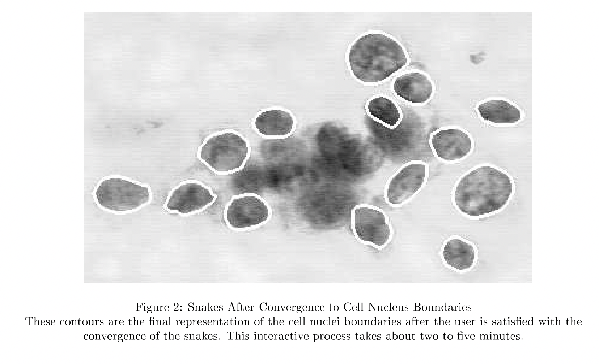

```{r setup, include=FALSE}
library(tidyverse); 
library(broom);
library(ggrepel);
library(knitr);
library(glue);
library(MASS);
library(tidyverse);
library(broom);
library(RColorBrewer);
library(pROC);
library(logistf);
library(glmnet);
library(glmnetUtils);
library(ggcorrplot);
knitr::opts_chunk$set(echo = T, warning = F, message = F, cache = F);
knitr::knit_hooks$set(mysize = function(before, options, envir) {
  if (before) 
    return(options$size);
})
options(digits = 3);
figure_scaler = 1/2;#1/2-3/8 for ioslides; ~1/3 for word, pdf
text_scaler = 3/3;#1 for ioslides; 2/3 for word, pdf
fig.x = 16 * figure_scaler;
fig.y = 9 * figure_scaler;
cex_scale = 9 * figure_scaler;
theme_set(theme_bw())

```


## Example: Breast Cancer Diagnosis data

Digitized image of fine needle aspirate (FNA) of breast mass from 569 patients 

{ width=75% }


@street.image; @mangasarian.opres

##

*Outcome* Clinical diagnosis (malignant or benign)

*Predictors*

a. radius (mean of distances from center to points on the perimeter)
b. texture (standard deviation of gray-scale values)
c. perimeter
d. area
e. smoothness (local variation in radius lengths)
f. compactness (perimeter^2 / area - 1.0)
g. concavity (severity of concave portions of the contour)
h. concave points (number of concave portions of the contour)
i. symmetry 
j. fractal dimension ("coastline approximation" - 1)


Data include mean, "standard error", and worst measurements. 

About 35% of diagnoses were malignant

## 

```{r, include = T, echo = F}
breast_dx <-
  read_csv("bdiag.csv", show_col_types = FALSE) %>%
  # Translate M/D into 1/0
  mutate(malignant = 1 * (diagnosis == "M")) %>% 
  # Drop errant space in 'concave points_mean' variable name 
  rename_with(~str_replace(string = ., pattern = " ", replacement = "")) %>%
  # Focus only on worst measurements
  #dplyr::select(malignant, 
  #       contains("_worst")) 
  dplyr::select(-id, -diagnosis)
set.seed(1)
fold_partition <- sample(c(rep(1, 200), rep(2, 200), rep(3, 169)))
training_index <- which(fold_partition == 1);
validation_index <- which(fold_partition == 2);
test_index <- which(fold_partition == 3);
write_csv(breast_dx %>% slice(training_index), file = "breast_dx_train.csv")
write_csv(breast_dx %>% slice(validation_index), file = "breast_dx_validation.csv")
write_csv(breast_dx %>% slice(test_index), file = "breast_dx_test.csv")

```


Original data are available at 
https://archive.ics.uci.edu/ml/datasets/breast+cancer+wisconsin+(diagnostic)


## 

Task: Build a prediction model to predict probability of being
malignant given cell characteristics.

1. Use the training data ('breast_dx_train.csv') and the validation data ('breast_dx_train.csv') to build and select the model. 

2. You can use logistic regression with any of model building approaches
we considered, or something else. You can alternatively build a classifier using a machine learning approach. Note that if you develop a model that only classifies observations, your MSPE, Absolute, and 0-1 loss will all be the same.

3. Use the training and validation data any way you want, but do not use the test data until you've selected one final model. No cheating and no going back to fiddle with the model after you've seen the test data!

4. Evaluate your one model on the test data ('breast_dx_test.csv') and report your performance metrics here: 

https://forms.gle/6kmfzTPok25hi4v26

##


## References
\scriptsize